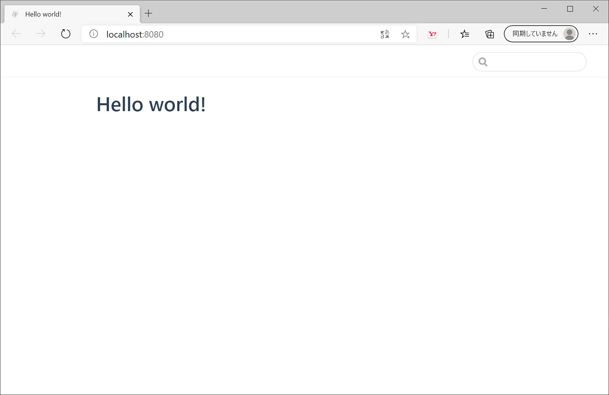

# vuepressをつかってみよう

## vuepressとは

 - Vue.js の作者、Evan Youさんが開発した静的サイトジェネレーター
 - markdown記法でファイルを作成できる
 - markdownのなかでvueが書ける

僕個人の主観ですが、サイトの細部の調整にはHTML、CSS、Vue.jsの知識が必要になってきますが、とりあえずサイトを作ってみたいという程度であれば、手順に従って進めるだけで簡単にWebサイトを製作できると実感しています。

[vuepress公式ドキュメント](https://vuepress.vuejs.org/)  

詳しくは上記の公式ドキュメントを参照してください。
この記事ではこれから、実際にサイトを作成する過程を**初学者目線**で解説するつもりですが、英語が得意な方やある程度知識のある方は公式ドキュメントのほうがおすすめです。  


## 事前準備

以下の2つをインストールします。  

 - [Node.js 10+](https://nodejs.org/en/)
   * LTS版とCurrent版がありますが、LTS版でよいと思います。
 - [Yarn Classic](https://classic.yarnpkg.com/en/)
   * vuepressのインストール及び動作には"Yarn"か"npm"が必要です。公式ドキュメントのおすすめはYarnですので、**ここから先ではYarnでの製作過程を解説します。**

## Hello world! を表示するまで

### ディレクトリの作成

まずはコマンドが叩けるエディターを開きます。  
特にこだわりがなければ、VS Codeなんかがいいんじゃないでしょうか。  
[Visual Studio Code](https://code.visualstudio.com/)  

ターミナルを開いたら任意のディレクトリに移動して、以下のコマンドを入力します。  

```bash
mkdir vuepress-sample && cd vuepress-sample
```

※今回はvuepress-sampleというディレクトリを作成して、そのなかにいろいろ作成していきます。  
　コマンドからではなく、直接GUI操作でここまで行っても構いません。  

### package.jsonの作成

```bash
yarn init
```

上記のコマンドを入力すると以下の項目の質問をされ、それに回答することでpackage.jsonが生成されます。 

|                |                                           |
|---------------:|:------------------------------------------|
|           name | プロジェクト名                            |
|        version | バージョン（デフォルト：1.0.0）            |
|    description | プロジェクトの概要                        |
|    entry point | エントリーポイント（デフォルト：index.js） |
| repository url | リポジトリURL（あれば記載）                |
|         auther | 著者名                                    |
|        license | 著作権（デフォルト：MIT）                  |

### VuePressのインストール

以下のコマンドを実行することで、vuepressがインストールされます。

```bash
yarn add -D vuepress@next
```

以下が、実行後のディレクトリ構成です。

> vuepress-sample  
>  ├ node_modules  
>  ├ package.json  
>  └ yarn.lock  

また、package.jsonが以下のようになっているかと思います。  

```json
{
  "devDependencies": {
    "vuepress": "^1.0.0-rc.1"
  },
  "name": "vuepress-sample",
  "version": "1.0.0",
  "description": "this is a sample",
  "main": "index.js",
  "author": "OKR",
  "license": "MIT"
}
```

### トップページの作成

では、トップページを作成していきましょう。  
初めにソースコードをまとめるディレクトリを作成します。  
公式ドキュメントでは、"docs"となっていますが、ここでは"src"とします。

```bash
mkdir src
```

> vuepress-sample  
>  ├ node_modules  
>  ├ src  
>  ├ package.json  
>  └ yarn.lock


次に、"src"ディレクトリの直下にトップページとなるmdファイルを作成し、"Hello world!"と記載していきます。  
今回は公式ドキュメントの推奨に従って、"README.md"と名づけます。  

```bash
cd src && touch README.md
```

> vuepress-sample  
>  ├ node_modules  
>  ├ src  
>  │    └ README.md  
>  ├ package.json  
>  └ yarn.lock


では、README.mdを編集します。  

```markdown
# Hello world!
```

これで、トップページが作成できたので、デバッグしてみましょう。  

### デバッグの前に

まず、package.jsonにこれから多用するvuepressのコマンドを定義していきます。  
package.jsonを開いて以下のコードを追加します。  

```json
{
  "scripts": {
      "dev": "vuepress dev src",
      "build": "vuepress build src"
  }
}
```

これにより、今後は以下のコマンドが使用できるようになります。  
 - `yarn dev`    :デバッグ  
 - `yarn build`  :リリース版のコンパイル  

### デバッグ（Hello world! を表示する）

さっそくデバッグして、トップページの表示を確認しましょう。  

```bash
yarn dev
```

これで、[http://localhost:8080/](http://localhost:8080/)にトップページが表示されたかと思います。  

<!--  -->



以上で完成です。  
本来はここから細かく画面を作っていくのですが、それはまた別の機会に記事にできたらと思います。  
ご指摘や、ご質問等あれば遠慮なくどうぞ！

